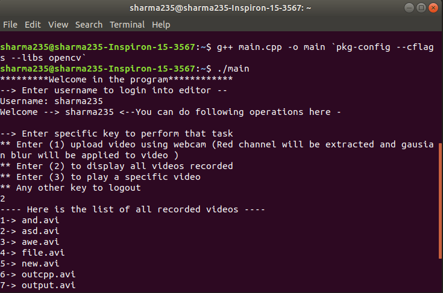

# c-opencv
opencv project using c++
# Installing opencv
This is c++ program made with opencv. To install opencv in ubuntu run following commands-
1.sudo apt-get update
2.sudo apt-get upgrade
3.sudo apt-get install libopencv-dev

# Compiling the program
After than compile the main.cpp file using following command.
(g++ main.cpp -o main \`pkg-config --cflags --libs opencv\`)

Then execute binary file using- 
(./main)

# Sample output for the program

